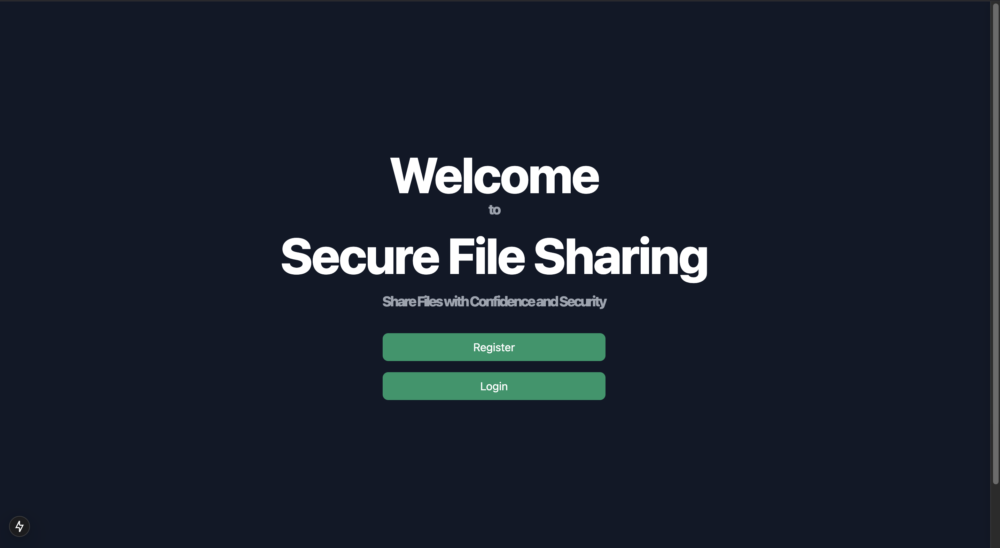

# Secure File Sharing

## Overview

**Secure File Sharing** is a web application that allows users to securely upload, share, and manage their files, ensuring data privacy through robust encryption protocols. The app uses modern tools and cloud services to provide a seamless and secure experience for users.

---

## Features

- **Encrypted File Upload**: Files are encrypted using AES-256 encryption before being uploaded.
- **User Authentication**: Secure authentication using JWT tokens.
- **Role-Based Access Control**: Define file access and sharing permissions.
- **Audit Logs**: Tracks all actions related to file uploads and access for transparency and accountability.

---

## Tech Stack

### 1. **Frontend**
   - **React with TypeScript**: A modern library for building interactive UIs with static type-checking for better developer experience.
   - **Next.js (App Router)**: A React framework for building server-rendered or statically generated applications with improved routing and flexibility using the App Router.
   - **TailwindCSS**: A utility-first CSS framework that allows you to quickly build custom designs.

### 2. **Backend**
   - **Django with Django REST Framework (DRF)**: A high-level Python web framework that simplifies database management and API creation. DRF is used for building the API for file uploads, sharing, and authentication.
   - **JWT Authentication**: Secure user authentication using JSON Web Tokens for stateless sessions.
   - **AES-256 Encryption**: Files are encrypted before uploading to ensure privacy and security.

### 3. **Database**
   - **SQLite3**: A lightweight, serverless, self-contained SQL database engine used to store user data, file metadata, and permissions.

### 4. **DevOps**
   - **Docker**: For containerization of the application, ensuring consistency across different environments.
   - **Docker Compose**: Used for running the backend and database services together in development.

---

## Installation

### Steps to Run the App

1. **Clone the Repository**

   ```bash
   git clone https://github.com/yourusername/secure-file-sharing.git
   cd secure-file-sharing
   ```

2. **Set Up Environment Variables**

   Create a `.env` file in the root of your project and add the following environment variables:

   ```
   # Database Config
   DATABASE_URL="sqlite:///db.sqlite3"

   # JWT Authentication Config
   JWT_SECRET_KEY="your-secret-key"

   # Encryption Config
   ENCRYPTION_KEY="your-encryption-key"
   ```

3. **Run the App Using Docker Compose**

   To build and start the application using Docker Compose, run the following command:

   ```bash
   docker-compose up --build
   ```

   This will set up all required services (backend, database) and make the application available at `http://localhost:8000`.

4. **Access the Application**

   Open your browser and go to `http://localhost:3000` to start using the app.

---

## Screenshots

Add screenshots of the application here to showcase its interface and functionality. For example:

- **Home Page**: 
---

## Usage

1. **User Authentication**
   Users can register and log in using their email and password. Upon successful login, a JWT token is returned for session management.

2. **Uploading Files**
   Once logged in, users can upload files, which are encrypted using AES-256 before being stored in the database.

3. **Sharing Files**
   Users can share uploaded files with others by specifying access permissions (either "view" or "edit").

---

## Security Considerations

- **AES-256 Encryption**: All files are encrypted before being uploaded to ensure data privacy.
- **JWT Authentication**: Secures user sessions by issuing JSON Web Tokens after user authentication.
- **HTTPS**: Ensures secure communication between the frontend and backend.
- **Role-Based Access Control (RBAC)**: Manages access to files based on user roles and permissions.
- **Audit Logs**: Tracks user actions for transparency and accountability.

---

## Deployment

To deploy the application to production, you can use Docker and cloud services such as AWS, Heroku, or DigitalOcean. Follow these steps to set up the Docker environment:

### Docker Setup

1. Build and run the Docker container with the following commands:

   ```bash
   docker build -t secure-file-sharing .
   docker run -p 8000:8000 secure-file-sharing
   ```

2. Access the application at `http://localhost:8000`.

---

## Testing

- **Unit Tests**: Write tests for individual components such as encryption, authentication, and file upload.
- **Integration Tests**: Ensure that the entire flow (file upload, sharing, encryption) works as expected.
- **Security Tests**: Test the system for common vulnerabilities, such as SQL injection and cross-site scripting (XSS).
